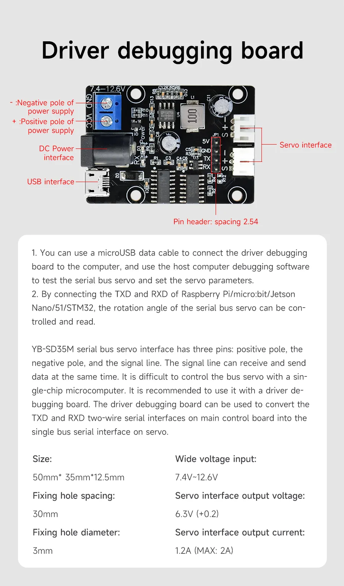
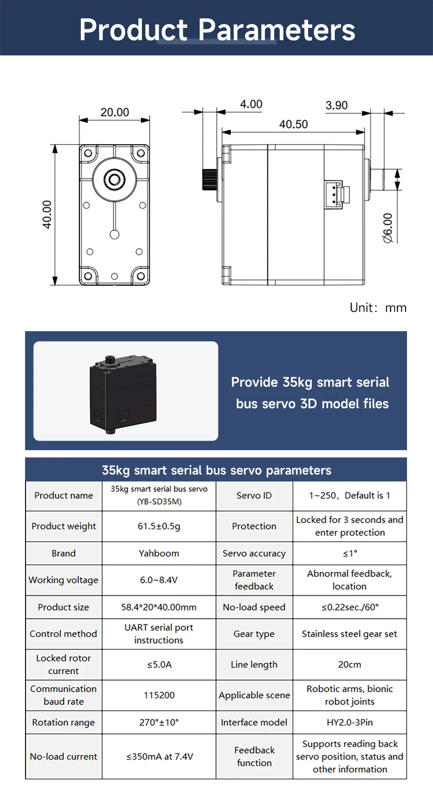
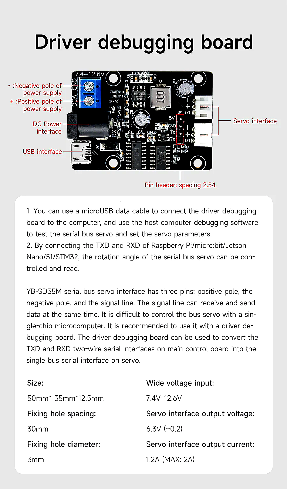
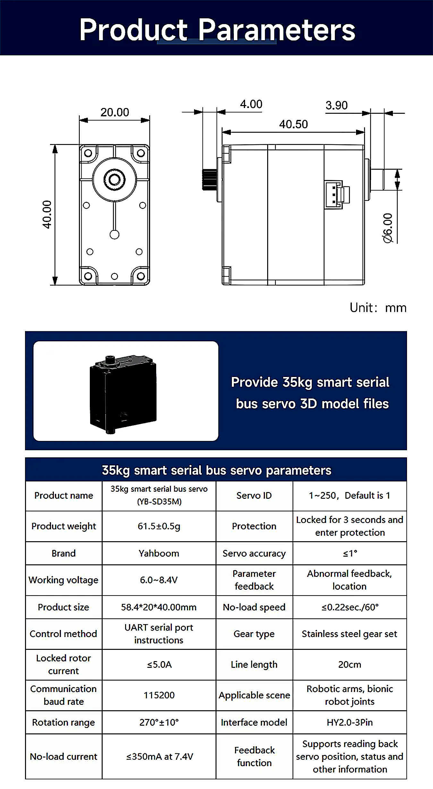
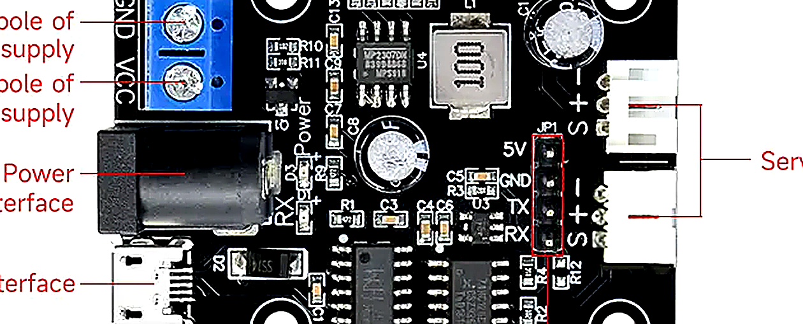
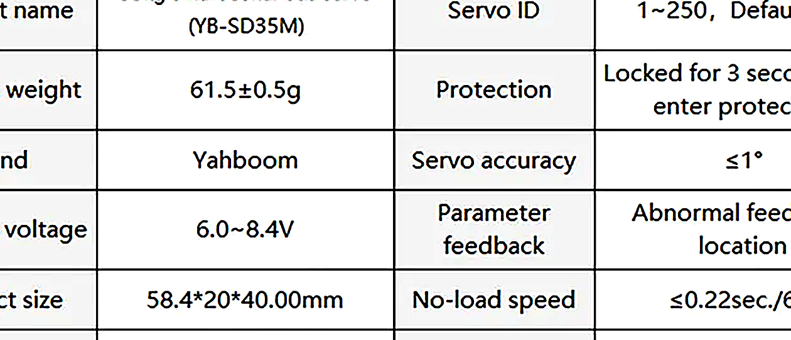
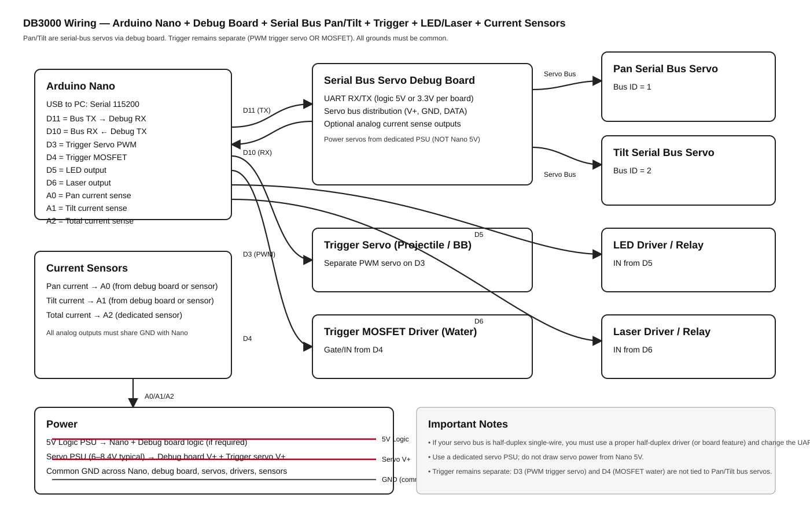
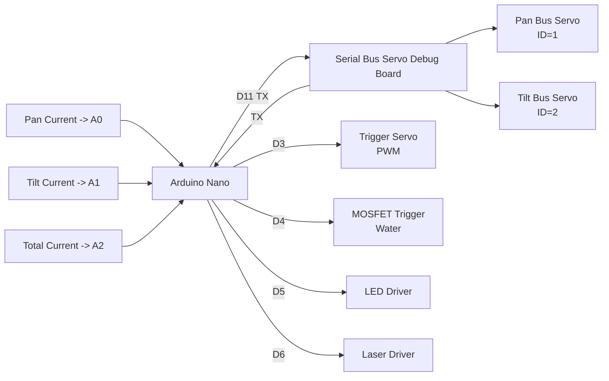

# Arduino Nano — Serial Bus Pan/Tilt Upgrade + Current Monitoring (2026)

## Purpose
This document provides:
1) An updated Arduino sketch for the **DB3000 Pan/Tilt serial bus servo upgrade** with **per-servo** and **total** current telemetry.
2) A wiring diagram (graphical) for Arduino Nano + debug board + serial bus servos + trigger + LED + Laser + current sensors.

**Critical requirement:** The **trigger actuator remains separate and must not be affected** by Pan/Tilt changes.

---

## Assumptions (confirm before wiring)
Because “serial bus servo” and “debug board” can vary by vendor, this document assumes:
- The **debug board exposes a TTL UART interface** (RX/TX) to the Arduino Nano.
- The debug board drives the **servo bus** (power and data distribution to Pan and Tilt servos).
- The debug board provides **analog current sense outputs** for Pan and Tilt (optional but supported by the sketch).
- A dedicated current sensor provides **total turret current** as an analog output.

If your debug board provides current via serial (instead of analog), the sketch’s current-reading block must be adapted (still straightforward).

---

## Servo Information (from provided images)

Reference images (as provided):





Enhanced “read the label/spec” helpers (auto-generated crops):

- Image 1 enhanced full:
  

- Image 2 enhanced full:
  

If the model text is small, check these crop highlights (center crops tend to be best):

- Image 1 crop (center):
  

- Image 2 crop (center):
  

Populate and keep this section accurate — firmware transport and wiring depend on it:

- **Servo family / exact model name:** Yahboom **YB-SD35M** (35kg serial bus servo) *(based on the provided product link and description)*
- **Vendor / series:** Yahboom SD-series bus servo (YB-SD35M)
- **Control protocol:** Serial bus (TTL UART bus) *(details below still must be confirmed)*
- **Rotation range:** **0–270°**
- **Mechanical notes:** Power output shaft + auxiliary fixed shaft; stainless steel gears + bearings; built-in high-precision potentiometer(s)
- **Connectors:** **3 × HY2.0-3Pin** interfaces (multiple wiring angles)
- **Multi-servo bus support:** Yes (multiple servos on same bus)
- **Servo IDs used (project plan):** Pan = 1, Tilt = 2 (confirm)

Items still required to confirm (do not guess):
- **Half-duplex vs full-duplex:** TBD (determines wiring/driver)
- **Bus baud rate(s):** TBD
- **Voltage range:** TBD (do not assume Nano 5V)
- **Stall current / peak current:** TBD (needed for current thresholds + PSU sizing)
- **Torque rating details:** “35kg” stated; confirm whether kg·cm and at what voltage
- **Speed spec:** TBD
- **Feedback support:** Description mentions “high-precision potentiometers / encoder”; confirm what feedback is exposed over bus (position/temp/voltage/current)
- **Connector pinout order:** TBD (V+, GND, DATA ordering)

If you paste the text/specs from the product page (or a datasheet link), this section can be fully filled in and the Arduino `setBusServoAngle()` implementation can be made correct for the exact protocol.

---

## Wiring Diagram (embedded SVG)



### Optional: Mermaid version (only if your renderer supports it)



---

## Pin Map (Arduino Nano)
- **D10**: Serial bus RX (Nano RX  ← Debug board TX)
- **D11**: Serial bus TX (Nano TX  → Debug board RX)
- **D3**: Trigger Servo PWM (Projectile / BB mode)
- **D4**: MOSFET trigger output (Water mode)
- **D5**: LED output (relay/MOSFET driver)
- **D6**: Laser output (relay/MOSFET driver)
- **A0**: Pan current analog input
- **A1**: Tilt current analog input
- **A2**: Total current analog input

**Power notes**
- Do **not** power Pan/Tilt bus servos from the Nano 5V pin.
- Use a dedicated servo power supply for Pan/Tilt bus and trigger servo.
- Ensure a **single common ground** between Nano, debug board, servo PSU, drivers, and sensors.

---

## Telemetry Format (MCU → Host)
The sketch outputs:

`CUR PmA=<pan_mA> TmA=<tilt_mA> TOTmA=<total_mA>`

at ~10 Hz by default.

---

## Updated Arduino Sketch
The full sketch is included below and is also saved in:
- arduino/DB3000_SerialBus_Upgrade_2026/DB3000_SerialBus_Upgrade_2026.ino

```cpp
/*
  DB3000 Serial Bus Servo Upgrade (2026)
  -------------------------------------
  هدف: Upgrade Pan & Tilt to serial-bus servos via a debug board, while keeping trigger system intact.

  Host -> MCU command format (unchanged):
    P{pan}T{tilt}F{fire}L{led}R{laser}G{acc}S{safety}M{mode}\n
  Notes:
  - Safety token: S0 = ARMED, S1 = SAFE  (matches app/turret_enhancements.py formatting)
  - Mode token:   M1 = Projectile (BB Servo trigger), M0 = Water (MOSFET trigger)

  Telemetry (MCU -> Host):
    CUR PmA=<pan_mA> TmA=<tilt_mA> TOTmA=<total_mA>\n
  IMPORTANT INVARIANT:
  - Trigger actuator remains separate from Pan/Tilt.
    * Water mode: MOSFET output pin.
    * Projectile mode: dedicated PWM trigger servo.

  You MUST adapt the serial-bus servo protocol to your servo model/debug board.
  The sketch provides an abstraction layer (ServoBusTransport + setBusServoAngle()).
*/

#include <Arduino.h>
#include <SoftwareSerial.h>
#include <Servo.h>

// ---------------------------
// Pin Mapping (Arduino Nano)
// ---------------------------

// Serial bus (to debug board)
// IMPORTANT: Many debug boards expect a UART. These pins assume separate RX/TX.
// If your board uses half-duplex single-wire, see notes in setBusServoAngle().
static const uint8_t PIN_BUS_RX = 10; // Nano RX  <- Debug board TX
static const uint8_t PIN_BUS_TX = 11; // Nano TX  -> Debug board RX

// Trigger outputs (must remain supported)
static const uint8_t PIN_TRIGGER_MOSFET = 4; // Water mode output (via MOSFET driver)
static const uint8_t PIN_TRIGGER_SERVO  = 3; // Projectile mode trigger servo (PWM)

// Accessory outputs
static const uint8_t PIN_LED_RELAY   = 5; // LED relay/MOSFET driver
static const uint8_t PIN_LASER_RELAY = 6; // Laser relay/MOSFET driver

// Current sensing (analog)
// Assumption: debug board exposes analog current sense for pan & tilt;
// total current comes from a dedicated sensor.
static const uint8_t PIN_CURR_PAN_A   = A0;
static const uint8_t PIN_CURR_TILT_A  = A1;
static const uint8_t PIN_CURR_TOTAL_A = A2;

// ---------------------------
// Serial configuration
// ---------------------------

static const uint32_t HOST_BAUD = 115200;
static const uint32_t BUS_BAUD  = 115200; // adjust if your bus servos require different rate

SoftwareSerial busSerial(PIN_BUS_RX, PIN_BUS_TX); // RX, TX

// ---------------------------
// Serial bus servo config
// ---------------------------

// IDs on the serial bus
static const uint8_t BUS_ID_PAN  = 1;
static const uint8_t BUS_ID_TILT = 2;

// Limits (degrees) - keep aligned with host UI limits
static const int PAN_MIN_DEG  = 0;
static const int PAN_MAX_DEG  = 220;
static const int TILT_MIN_DEG = 0;
static const int TILT_MAX_DEG = 70;

// Direction invert (set true if axis moves opposite)
static const bool INVERT_PAN  = false;
static const bool INVERT_TILT = false;

// Optional speed/accel mapping (placeholder)
static const uint16_t DEFAULT_MOVE_TIME_MS = 60; // servo-side move time; tune for smoothness

// ---------------------------
// Trigger config
// ---------------------------

Servo triggerServo;

// Projectile trigger servo angles (tune for your mechanism)
static const int TRIG_SERVO_REST_DEG = 20;
static const int TRIG_SERVO_FIRE_DEG = 70;
static const uint16_t TRIG_PULSE_MS  = 90;
static const uint16_t TRIG_COOLDOWN_MS = 120;

// ---------------------------
// Current conversion config
// ---------------------------

// All current values reported in mA.
// These conversion factors depend on your hardware.
// Provide a simple linear model: mA = slope_mA_per_count * adc + offset_mA.

struct CurrentCal {
  float slope_mA_per_count;
  float offset_mA;
};

// Default placeholders (MUST calibrate)
static const CurrentCal CAL_PAN   = { 5.0f, 0.0f };
static const CurrentCal CAL_TILT  = { 5.0f, 0.0f };
static const CurrentCal CAL_TOTAL = { 5.0f, 0.0f };

static inline int adcToMilliAmps(int adc, const CurrentCal &cal) {
  float mA = cal.slope_mA_per_count * (float)adc + cal.offset_mA;
  if (mA < 0) mA = 0;
  return (int)(mA + 0.5f);
}

// Telemetry rate
static const uint16_t TELEMETRY_HZ = 10;
static uint32_t lastTelemetryMs = 0;

// ---------------------------
// Host command state
// ---------------------------

struct HostCommand {
  int panDeg = 90;
  int tiltDeg = 40;
  int fire = 0;   // F
  int led = 0;    // L
  int laser = 0;  // R
  int acc = 0;    // G
  int safety = 1; // S (1=safe)
  int mode = 0;   // M (1=BB servo)
};

static HostCommand cmd;

static int lastFireToken = 0;
static uint32_t lastFireMs = 0;

// ---------------------------
// Utilities
// ---------------------------

static inline int clampInt(int v, int lo, int hi) {
  if (v < lo) return lo;
  if (v > hi) return hi;
  return v;
}

static inline int applyInvertAndClamp(int deg, int minDeg, int maxDeg, bool invert) {
  deg = clampInt(deg, minDeg, maxDeg);
  if (!invert) return deg;
  // invert around the midpoint of the allowed range
  const int span = maxDeg - minDeg;
  const int rel = deg - minDeg;
  return minDeg + (span - rel);
}

// ---------------------------
// Serial-bus servo protocol adapter
// ---------------------------

/*
  IMPORTANT:
  This function MUST be adapted to your servo model/debug board protocol.

  Common patterns:
  - LewanSoul/LX-16A style: binary packets, position 0..1000, time in ms
  - Feetech/STS/SC series: different packet framing
  - Debug board may already abstract to a simple ASCII protocol (e.g., "#1P1500T50")

  This sketch currently assumes an ASCII adapter protocol supported by your debug board:
    SB,<id>,<deg>,<time_ms>\n
  Example:
    SB,1,90,60

  If your debug board uses a different protocol, replace the body of this function.
*/
static void setBusServoAngle(uint8_t id, int deg, uint16_t moveTimeMs) {
  busSerial.print(F("SB,"));
  busSerial.print(id);
  busSerial.print(F(","));
  busSerial.print(deg);
  busSerial.print(F(","));
  busSerial.print(moveTimeMs);
  busSerial.print('\n');
}

static void applyPanTilt() {
  const int pan = applyInvertAndClamp(cmd.panDeg, PAN_MIN_DEG, PAN_MAX_DEG, INVERT_PAN);
  const int tilt = applyInvertAndClamp(cmd.tiltDeg, TILT_MIN_DEG, TILT_MAX_DEG, INVERT_TILT);

  setBusServoAngle(BUS_ID_PAN, pan, DEFAULT_MOVE_TIME_MS);
  setBusServoAngle(BUS_ID_TILT, tilt, DEFAULT_MOVE_TIME_MS);
}

// ---------------------------
// Trigger handling (must remain intact)
// ---------------------------

static bool isArmed() {
  return cmd.safety == 0;
}

static void setMosfet(bool on) {
  digitalWrite(PIN_TRIGGER_MOSFET, on ? HIGH : LOW);
}

static void pulseTriggerServo() {
  const uint32_t now = millis();
  if (now - lastFireMs < TRIG_COOLDOWN_MS) return;

  triggerServo.write(TRIG_SERVO_FIRE_DEG);
  delay(TRIG_PULSE_MS);
  triggerServo.write(TRIG_SERVO_REST_DEG);

  lastFireMs = now;
}

static void applyTrigger() {
  if (!isArmed()) {
    setMosfet(false);
    triggerServo.write(TRIG_SERVO_REST_DEG);
    lastFireToken = cmd.fire;
    return;
  }

  if (cmd.mode == 0) {
    // Water (MOSFET): supports hold
    setMosfet(cmd.fire != 0);
  } else {
    // Projectile (BB servo): pulse on rising edge
    const bool rising = (cmd.fire != 0) && (lastFireToken == 0);
    if (rising) {
      pulseTriggerServo();
    }
    setMosfet(false);
  }

  lastFireToken = cmd.fire;
}

// ---------------------------
// Accessory outputs
// ---------------------------

static void applyAccessories() {
  digitalWrite(PIN_LED_RELAY, cmd.led ? HIGH : LOW);
  digitalWrite(PIN_LASER_RELAY, cmd.laser ? HIGH : LOW);
}

// ---------------------------
// Telemetry
// ---------------------------

static void sendTelemetryIfDue() {
  const uint32_t now = millis();
  const uint32_t interval = (TELEMETRY_HZ == 0) ? 1000 : (1000UL / TELEMETRY_HZ);
  if (now - lastTelemetryMs < interval) return;

  const int panAdc = analogRead(PIN_CURR_PAN_A);
  const int tiltAdc = analogRead(PIN_CURR_TILT_A);
  const int totAdc = analogRead(PIN_CURR_TOTAL_A);

  const int panmA = adcToMilliAmps(panAdc, CAL_PAN);
  const int tiltmA = adcToMilliAmps(tiltAdc, CAL_TILT);
  const int totmA = adcToMilliAmps(totAdc, CAL_TOTAL);

  Serial.print(F("CUR PmA="));
  Serial.print(panmA);
  Serial.print(F(" TmA="));
  Serial.print(tiltmA);
  Serial.print(F(" TOTmA="));
  Serial.print(totmA);
  Serial.print('\n');

  lastTelemetryMs = now;
}

// ---------------------------
// Host command parsing
// ---------------------------

static bool parsePackedCommand(const char *line, HostCommand &out) {
  auto findTok = [&](char tok, int &value) -> bool {
    const char *p = strchr(line, tok);
    if (!p) return false;
    p++;
    value = atoi(p);
    return true;
  };

  HostCommand c = out;
  bool ok = true;

  ok = findTok('P', c.panDeg) && ok;
  ok = findTok('T', c.tiltDeg) && ok;
  ok = findTok('F', c.fire) && ok;
  ok = findTok('L', c.led) && ok;
  ok = findTok('R', c.laser) && ok;
  findTok('G', c.acc);
  ok = findTok('S', c.safety) && ok;
  ok = findTok('M', c.mode) && ok;

  if (!ok) return false;

  c.panDeg = clampInt(c.panDeg, PAN_MIN_DEG, PAN_MAX_DEG);
  c.tiltDeg = clampInt(c.tiltDeg, TILT_MIN_DEG, TILT_MAX_DEG);
  c.fire = (c.fire != 0) ? 1 : 0;
  c.led = (c.led != 0) ? 1 : 0;
  c.laser = (c.laser != 0) ? 1 : 0;
  c.safety = (c.safety != 0) ? 1 : 0;
  c.mode = (c.mode != 0) ? 1 : 0;

  out = c;
  return true;
}

static bool readLineFromHost(char *buf, size_t bufLen) {
  static size_t idx = 0;

  while (Serial.available() > 0) {
    char ch = (char)Serial.read();
    if (ch == '\r') continue;

    if (ch == '\n') {
      buf[idx] = 0;
      idx = 0;
      return true;
    }

    if (idx + 1 < bufLen) {
      buf[idx++] = ch;
    } else {
      idx = 0;
    }
  }

  return false;
}

// ---------------------------
// Setup / Loop
// ---------------------------

void setup() {
  Serial.begin(115200);
  busSerial.begin(115200);

  pinMode(4, OUTPUT);
  pinMode(5, OUTPUT);
  pinMode(6, OUTPUT);

  digitalWrite(4, LOW);
  digitalWrite(5, LOW);
  digitalWrite(6, LOW);

  triggerServo.attach(3);
  triggerServo.write(20);

  Serial.println(F("DB3000 SerialBus Upgrade 2026: READY"));
}

void loop() {
  static char line[96];

  if (readLineFromHost(line, sizeof(line))) {
    if (line[0] != 0) {
      HostCommand next = cmd;
      if (parsePackedCommand(line, next)) {
        cmd = next;
        applyAccessories();
        applyPanTilt();
        applyTrigger();
      } else {
        Serial.print(F("WARN BAD_CMD "));
        Serial.println(line);
      }
    }
  }

  sendTelemetryIfDue();
}
```

---

## What you MUST customize
1) **Serial bus servo protocol** inside `setBusServoAngle()`
   - The provided `SB,<id>,<deg>,<time_ms>` is a placeholder.
2) Current sensor calibration constants (`CAL_PAN`, `CAL_TILT`, `CAL_TOTAL`).
3) Trigger servo angles (`TRIG_SERVO_REST_DEG`, `TRIG_SERVO_FIRE_DEG`).

If you tell me the **exact servo model** and the **debug board type**, I can replace the placeholder protocol with the correct packet framing for your hardware.
