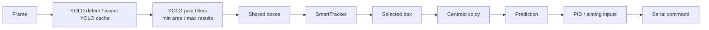
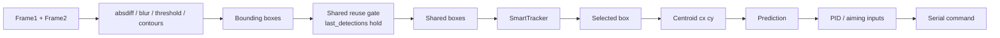
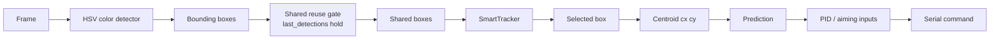
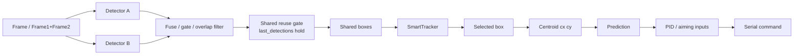

# Detection Pipeline Parity Requirement

## Purpose

This document records a full detection-pipeline parity audit for all detection modes and establishes a permanent rule:

**Any change affecting detection, centroid generation, bounding boxes, tracking, prediction, diagnostics, or PID aiming inputs must be validated across all detection modes before merge.**

## Detection modes covered

- YOLO
- Frame Difference
- Background Subtraction
- Color Detection
- Hybrid modes
  - FrameDiff + BackSub
  - FrameDiff + YOLO
  - BackSub + YOLO
  - Color + FrameDiff
  - Color + BackSub
  - Color + YOLO

## Unified convergence point

All modes converge on the shared `boxes` handoff in [app/MAIN_FILE_SINGLE_CAM.py](app/MAIN_FILE_SINGLE_CAM.py#L21510-L21704), then flow through the same post-detection path:

1. Mode-specific detector produces `boxes`
2. Optional stale/reused `boxes` substitution may occur
3. `SmartTracker.update_detections(boxes, frame_width, frame_height)` runs
4. `candidate_boxes = smoothed_boxes if smoothed_boxes else boxes`
5. Selected box becomes `(x, y, w, h)`
6. Centroid becomes `(cx, cy)`
7. `_speed_update_target_motion(cx, cy)`
8. `_speed_predict_target(cx, cy)`
9. `err_x`, `err_y`
10. PID / aiming math
11. `send_serial_command()`

**Safest shared integration point:** immediately before `tracker.update_detections(...)` in [app/MAIN_FILE_SINGLE_CAM.py](app/MAIN_FILE_SINGLE_CAM.py#L21686-L21698).

This is the last point where all modes have been normalized into `boxes` and the first point before shared SmartTracker → prediction → PID logic begins.

## Pipeline diagrams

### YOLO

### Frame Difference

### Background Subtraction

```mermaid
flowchart LR
    A[Frame] --> B[MOG2 background subtractor]
    B --> C[Warmup / morphology / contours]
    C --> D[Bounding boxes]
    D --> E[Shared reuse gate<br/>last_detections hold]
    E --> F[Shared boxes]
    F --> G[SmartTracker]
    G --> H[Selected box]
    H --> I[Centroid cx cy]
    I --> J[Prediction]
    J --> K[PID / aiming inputs]
    K --> L[Serial command]
```

### Color Detection

### Hybrid modes

## Parity audit findings

### 1. Do all modes converge to the same tracking input?

**Partially yes.**

They all converge to a shared `boxes` list and then to a shared centroid / prediction / PID path in [app/MAIN_FILE_SINGLE_CAM.py](app/MAIN_FILE_SINGLE_CAM.py#L21686-L21879).

What is unified:
- bounding box list (`boxes`)
- selected box `(x, y, w, h)`
- centroid `(cx, cy)`
- prediction call
- PID error inputs `err_x`, `err_y`
- serial output stage

What is **not** fully unified:
- `SmartTracker` confidence is produced but discarded (`smoothed_boxes, _ = tracker.update_detections(...)`) at [app/MAIN_FILE_SINGLE_CAM.py](app/MAIN_FILE_SINGLE_CAM.py#L21698)
- there is no shared detector-agnostic freshness object passed forward
- freshness is implicit only through:
  - `_boxes_are_reused`
  - `last_seen_time`
  - async YOLO result age in `_speed_yolo_detect_async()`

### 2. Detector outputs that may be stale or reused

#### A. Global `last_detections` reuse gate
Location: [app/MAIN_FILE_SINGLE_CAM.py](app/MAIN_FILE_SINGLE_CAM.py#L21510-L21549)

Behavior:
- if `boxes` is empty
- and mode is **not** pure YOLO (`detection_mode != 2`)
- and `last_detections` exists
- and `(now - last_seen_time) <= lost_hold_seconds`

then `boxes` is repopulated from `last_detections` and `_boxes_are_reused = True`.

Reuse duration:
- up to `lost_hold_seconds`
- default shown in code path: `5.0` seconds

Affected modes:
- 0 Frame Difference
- 1 Background Subtraction
- 3 FrameDiff + BackSub
- 4 FrameDiff + YOLO
- 5 BackSub + YOLO
- 6 Color
- 7 Color + FrameDiff
- 8 Color + BackSub
- 9 Color + YOLO

Not affected by this specific reuse gate:
- 2 YOLO

#### B. Async YOLO recent-result reuse
Location: [app/MAIN_FILE_SINGLE_CAM.py](app/MAIN_FILE_SINGLE_CAM.py#L18324-L18378)

Behavior:
- threaded YOLO returns the most recent cached result if its age is within `max_age`
- `max_age` comes from `_speed_dynamic_yolo_max_age_s()`

Reuse duration:
- bounded by `speed_threaded_yolo_max_age_s`
- default compatibility path uses about `0.35` seconds unless dynamically reduced

Affected modes when threaded YOLO is enabled:
- 2 YOLO
- 4 FrameDiff + YOLO
- 5 BackSub + YOLO
- 9 Color + YOLO

### 3. Paths where centroid updates can occur without a fresh detector frame

Yes.

This can occur through:
- global `last_detections` reuse gate for non-pure-YOLO modes
- async YOLO cached results for YOLO-bearing modes
- background-subtractor warmup phases followed by hold-window reuse

Common centroid path:
- selected box stored at [app/MAIN_FILE_SINGLE_CAM.py](app/MAIN_FILE_SINGLE_CAM.py#L21761-L21769)
- centroid / aiming point consumed at [app/MAIN_FILE_SINGLE_CAM.py](app/MAIN_FILE_SINGLE_CAM.py#L21842-L21865)

### 4. Do any detection modes bypass SmartTracker?

No mode-specific bypass was found.

All modes feed `boxes` into `SmartTracker` at [app/MAIN_FILE_SINGLE_CAM.py](app/MAIN_FILE_SINGLE_CAM.py#L21690-L21698).

However, there is a **global fallback**:
- if `smart_tracker` is unavailable or errors
- or if `smoothed_boxes` is empty
- the system falls back to raw `boxes`

Fallback location: [app/MAIN_FILE_SINGLE_CAM.py](app/MAIN_FILE_SINGLE_CAM.py#L21707-L21716)

### 5. Where prediction diagnostics can accidentally measure reused detections

Prediction measurement can capture reused or cached detections instead of fresh detector output when:
- `_boxes_are_reused = True` via the global hold-window reuse gate
- async YOLO returns cached boxes within freshness window

That means a diagnostic sample may represent:
- previous prediction vs next **processed aiming sample**

not strictly always:
- previous prediction vs next **fresh detector emission**

## Detection Freshness and Reuse Behavior

### 1. Detection reuse paths

- FrameDiff, BackSub, and Color-based pipelines may reuse `boxes` through the `lost_hold_seconds` hold window.
- This reuse is implemented by repopulating `boxes` from `last_detections` when the detector returns nothing and the hold window is still active.
- Default hold duration in the current path is up to **5 seconds**.

Relevant location:
- [app/MAIN_FILE_SINGLE_CAM.py](app/MAIN_FILE_SINGLE_CAM.py#L21510-L21549)

### 2. Async YOLO caching

- Threaded YOLO mode may reuse cached detection results.
- Cached results are accepted while their age remains within the configured freshness window.
- Maximum cache age is typically around **0.35 seconds** unless configured otherwise or dynamically reduced.

Relevant location:
- [app/MAIN_FILE_SINGLE_CAM.py](app/MAIN_FILE_SINGLE_CAM.py#L18324-L18378)

### 3. Tracking pipeline meaning

The runtime tracking pipeline operates on the **next processed aiming center**, not strictly the next fresh detector emission.

That processed aiming center may come from:
- fresh detector output
- reused hold-window detection
- cached YOLO detection

### 4. Prediction diagnostics interpretation

Prediction error statistics measure:

- **previous prediction vs next processed aiming sample**

That sample may originate from:
- fresh detector output
- reused hold-window detection
- cached YOLO detection

### 5. Development rule

Improvements to prediction, diagnostics, or tracking must assume that detection inputs may sometimes be reused or cached.

Fresh-frame assumptions must **not** be hardcoded unless a dedicated freshness flag is implemented and carried through the shared tracking path.

## Detection mode audit table

| Mode | Detector output path | Shared `boxes` path | SmartTracker path | Reuse risk | Notes |
|---|---|---|---|---|---|
| 0 FrameDiff | absdiff → contours → boxes | Yes | Yes | Hold-window reuse | motion-only |
| 1 BackSub | MOG2 → contours → boxes | Yes | Yes | Warmup + hold-window reuse | warmup can produce empty frames |
| 2 YOLO | YOLO / async cached YOLO | Yes | Yes | Async cache only | explicit global stale-box reuse disabled |
| 3 FrameDiff + BackSub | dual detector → fuse | Yes | Yes | Hold-window reuse | fused boxes then shared path |
| 4 FrameDiff + YOLO | motion gate → YOLO | Yes | Yes | Hold-window reuse + async YOLO cache | YOLO may be skipped when gate not met |
| 5 BackSub + YOLO | overlap filter / fallback | Yes | Yes | Hold-window reuse + async YOLO cache | fallback to YOLO-only possible |
| 6 Color | color detector | Yes | Yes | Hold-window reuse | HSV-driven |
| 7 Color + FrameDiff | dual detector → color fusion | Yes | Yes | Hold-window reuse | fusion strategy AND/OR |
| 8 Color + BackSub | dual detector → color fusion | Yes | Yes | Warmup + hold-window reuse | backSub warmup still applies |
| 9 Color + YOLO | dual detector → color fusion | Yes | Yes | Hold-window reuse + async YOLO cache | YOLO post-filters still apply |

## Detection Change Impact Checklist

1. Does the change affect detector outputs?
2. Does the change affect centroid generation?
3. Does the change affect bounding box reuse or hold windows?
4. Does the change affect SmartTracker inputs?
5. Does the change affect prediction inputs?
6. Does the change affect PID error inputs?
7. Has the change been validated in **ALL** detection modes?
   - YOLO
   - FrameDiff
   - BackSub
   - Color
   - Hybrid modes

## Merge rule

**A change that only works for one detection mode must not be merged until parity across all modes is confirmed.**

## Audit conclusion

- All detection modes do converge into a common post-detection tracking path.
- The best shared insertion point for future tracking / prediction / diagnostics work is the `boxes` → `SmartTracker` handoff.
- Freshness and confidence are not yet normalized into a single shared tracking input object.
- Reuse exists and must be considered in any future diagnostics or prediction-accuracy work.
