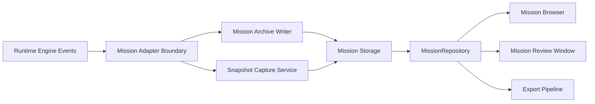
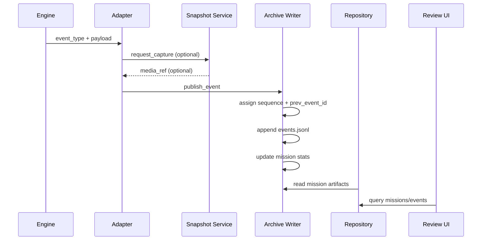

# Mission Review Technical Documentation

## 1. Purpose and Scope
This document describes the Mission Review subsystem from a systems architecture perspective.

It covers:
- Overall architecture
- Data flow
- Mission Archive schema
- Event lifecycle
- Threading model
- Queue architecture
- Storage layout
- Event taxonomy
- Mission Review UI architecture
- Export architecture
- Adapter architecture
- Performance considerations
- Extension points

This document is intentionally design-oriented and operational. It does not describe source-level implementation details.

## 2. Overall Architecture
Mission Review is built as a layered pipeline:

1. Runtime producers
- The runtime engine emits mission events and state transitions.
- Detection, tracking, planner, engagement, fire, safety, and system signals are normalized into mission event payloads.

2. Adapter boundary
- A runtime adapter transforms engine callbacks into archive-ready event records.
- The adapter also coordinates snapshot capture requests for selected event types.

3. Archive services
- Mission Archive Writer persists immutable event streams and mission manifests.
- Snapshot Capture Service persists deduplicated image artifacts.

4. Mission repository
- MissionRepository provides read and management operations for mission data.
- It maps raw archive records into review-ready summaries and typed event views.

5. Mission Review UI
- Mission Browser lists missions and supports operational actions.
- Mission Review Window provides timeline, inspector, annotations, and visual snapshot review.

6. Export subsystem
- Export pipeline builds CSV, JSON, HTML, PDF, archive zips, image zips, and complete package artifacts.

## 3. Data Flow
### 3.1 Runtime to archive
1. Engine emits event callback with payload.
2. Adapter determines mission state and ensures mission context exists.
3. For capture-eligible events, adapter requests snapshot capture.
4. Adapter publishes event to Mission Archive Writer with timestamp, payload, and optional media refs.
5. Writer assigns global mission sequence and prev_event_id linkage.
6. Writer appends event JSONL and updates mission stats in memory.
7. On mission end, writer finalizes manifest with duration, status, and aggregate stats.

### 3.2 Archive to review
1. Repository enumerates mission folders.
2. Repository reads mission manifest and event stream.
3. Repository maps raw event types to review categories.
4. UI model/proxy applies search and filter constraints.
5. Inspector renders category-specific detail views.

### 3.3 Review to export
1. User requests export for a mission.
2. Export layer loads manifest, annotations, events, and computed stats.
3. Output artifacts are generated and bundled.
4. Archive payload excludes generated exports to prevent recursive inclusion.

## 4. Mission Archive Schema
### 4.1 Versioning
Archive schema is versioned with explicit constants for:
- mission archive schema version
- mission event schema version

This supports backward compatibility checks and controlled evolution.

### 4.2 Mission manifest
Per mission, mission_manifest.json contains at minimum:
- mission_id
- started_at
- ended_at
- duration_s
- status
- metadata
- initial_config_snapshot
- stats
- mission_size_bytes
- archive_schema_version
- event_schema_version

### 4.3 Event record
Events are stored as JSON Lines in events.jsonl.
Each event record contains:
- mission_id
- sequence
- event_id
- prev_event_id
- occurred_at
- written_at
- event_type
- source
- severity
- data
- tags
- media_refs
- config_snapshot
- archive_schema_version
- event_schema_version

### 4.4 Snapshot metadata linkage
Snapshot files are persisted under mission snapshots path and linked through media_refs in event records.

## 5. Event Lifecycle
Event lifecycle in archive context:

1. Draft creation
- Adapter creates a normalized event draft with payload, timestamp, and optional media refs.

2. Coercion and normalization
- Event fields are normalized for required defaults, severity constraints, and list uniqueness.

3. Sequencing
- Writer assigns strictly increasing mission-local sequence numbers.
- Writer stores prev_event_id chain for linear integrity.

4. Persistence
- Event appended to events.jsonl.
- Writer flushes data and updates in-memory aggregate counters.

5. Finalization
- Mission start and end markers frame lifecycle boundaries.
- Manifest finalization captures totals and metadata.

6. Review projection
- Repository maps event_type into review category.
- Inspector projects event into category-specific details.

## 6. Threading Model
Mission Review runtime path is asynchronous and multi-threaded by design.

Threads and responsibilities:
- UI/Main thread
  - Owns runtime orchestrator and user interactions.
  - Submits archive and snapshot work requests.

- Mission Archive Writer thread
  - Consumes event commands from queue.
  - Performs ordered event persistence and manifest updates.

- Snapshot Capture Writer thread
  - Consumes frame write requests from queue.
  - Performs JPEG persistence with retry and dedup tracking.

Concurrency principles:
- UI thread is not blocked on disk writes.
- Queue boundaries isolate producer burst load from storage latency.
- Health snapshots expose queue depth, failures, and drop counters.

## 7. Queue Architecture
There are two core queue paths.

1. Archive writer queue
- Accepts start_mission, event, end_mission, and stop commands.
- Drop behavior is explicit when queue is saturated and retries fail.
- Preserves event ordering via single-threaded consumer sequence assignment.

2. Snapshot capture queue
- Accepts write_snapshot commands with in-memory frames.
- Applies dedup by mission_id and frame_key to avoid duplicate writes.
- Tracks transient failures, write failures, and dropped requests.

Key behavior guarantees:
- Event ordering is deterministic per mission.
- Snapshot dedup avoids repeated storage of identical frame signatures.
- Backpressure is observable through health metrics.

## 8. Storage Layout
Default storage root:
- logs/mission_archive

Validation and forensic runs may use dedicated roots, for example:
- logs/mission_archive_phase5_validation

Per mission layout:

- mission_<timestamp>_<id>/
  - mission_manifest.json
  - events.jsonl
  - annotations.json
  - snapshots/
  - exports/

Export layout inside mission exports path:
- mission_<id>_events.csv
- mission_<id>_metadata.json
- mission_<id>_report.html
- mission_<id>_report.pdf
- mission_<id>_archive.zip
- mission_<id>_images.zip
- mission_<id>_annotated_images.zip
- mission_<id>_complete_package.zip

## 9. Event Taxonomy
Mission Review uses category-level taxonomy for filtering, inspection, and statistics.

Primary categories:
- detection
- tracking
- planner
- engagement
- fire
- configuration
- system

Operational notes:
- Fire is a dedicated category and not merged into engagement.
- Category mapping is derived from event_type signatures.

Representative event families:
- system: mission_started, mission_ended, engine_state_transition
- configuration: runtime_config_snapshot
- engagement: engagement_telemetry
- fire: fire_event and fire-prefixed events
- tracking: tracking and motion policy transitions
- detection: detection evaluation and classifier events

## 10. Mission Review UI Architecture
### 10.1 Mission Browser
Responsibilities:
- Load mission summaries
- Search and filter mission list
- Open selected mission review
- Rename mission
- Duplicate mission
- Delete mission
- Trigger mission export

### 10.2 Mission Review Window
Main panels:
- Timeline panel (event table with proxy filtering)
- Snapshot viewer panel (raw/annotated rendering and overlays)
- Inspector panel (category-specific details)
- Statistics panel
- Annotation panel

Inspector architecture by category:
- detection_metrics
- tracking_metrics
- planner_metrics
- engagement_metrics
- fire_metrics
- system payload projection

Fire inspector includes at minimum:
- fire timestamp
- burst number
- burst index
- fire mode
- trigger source
- auto/manual trigger state
- authorization chain
- hold-time result
- refractory state
- safety state
- motion policy state
- final fire approval
- final veto reason
- actuator command issued
- fire completion state

## 11. Export Architecture
Export pipeline stages:

1. Data acquisition
- Manifest
- Annotations
- Event stream
- Computed statistics

2. Artifact generation
- CSV events
- JSON metadata package
- HTML report
- PDF report
- Annotated image render output

3. Packaging
- Mission archive zip
- Images zip
- Annotated images zip
- Complete package zip

Safety and integrity behaviors:
- Archive packaging excludes exports subtree.
- Zip writer avoids self-inclusion of output archive.

## 12. Adapter Architecture
The adapter boundary transforms runtime engine events into archive persistence commands.

Adapter responsibilities:
- Ensure mission context start/end
- Normalize event timestamp and payload shape
- Request snapshots for selected event types
- Attach media refs to mission events
- Forward event to writer with ensure_mission policy

Adapter compatibility goals:
- Preserve key event fields required by review and legacy consumers
- Preserve source timestamps
- Preserve tracker identifiers
- Preserve motion policy history payloads
- Avoid duplicate and dropped adapter-sequenced events under nominal load

## 13. Performance Considerations
Design choices supporting performance:
- Async writer and snapshot threads decouple UI from IO
- Queue-based ingestion smooths bursty event flow
- Lightweight JSONL append model avoids full-file rewrites
- Snapshot dedup reduces storage pressure and write amplification

Operational indicators:
- Archive writer queue depth
- Dropped event counter
- Failed write counter
- Snapshot transient/write failures
- Archive on vs archive off frame-processing deltas

Known scaling levers:
- Queue sizes
- Snapshot JPEG quality
- Export batch size and concurrency policy
- Mission retention and archival strategy

## 14. Extension Points for Future Features
Mission Review is designed with explicit extension seams.

1. Taxonomy extension
- Add new event families and category mappings.
- Add category-specific inspector renderers.

2. Schema evolution
- Increment archive/event schema versions.
- Add optional fields while preserving old reader behavior.

3. Statistics extension
- Add new derived metrics for fire, planner, tracking, and safety behavior.

4. Export extension
- Add additional report formats or domain-specific audit bundles.

5. Storage extension
- Introduce retention tiers or remote object storage adapters.

6. UI extension
- Add richer timeline virtualization, drill-down views, and comparative mission analysis.

7. Validation extension
- Expand deterministic runtime acceptance probes and compatibility suites.

## 15. Reliability and Compatibility Guarantees
Current architecture enforces:
- Mission-local event ordering and chain integrity
- Explicit lifecycle boundaries (mission_started / mission_ended)
- Snapshot deduplication with deterministic frame keys
- Backward-compatible event payload expectations for review/export consumers

Compatibility should continue to be validated with deterministic runtime scenarios whenever schema, adapter, or event semantics change.
